# Arbre des composants React

```
App
|
+--- BrowserRouter
     |
     +--- Suspense
          |
          +--- Loading
          |    |
          |    +--- BirdyLogo
          |
          +--- Routes
               |
               +--- NotFound
               |
               +--- Login
               |    |
               |    +--- BirdyLogo
               |
               +--- Signup
               |    |
               |    +--- BirdyLogo
               |
               +--- Dashboard
               |    |
               |    +--- NavBar
               |    |    |
               |    |    +--- BirdyLogo
               |    |    |
               |    |    +--- [MenuIcon]
               |    |
               |    +--- TimeLine
               |    |    |
               |    |    +--- [Tweet || TweetDeleted]
               |    |         |
               |    |         +--- [TweetIcon]
               |    |         |
               |    |         +--- [CustomLink]
               |    |
               |    +--- SideBar
               |         |
               |         +--- SearchBar
               |
               +--- Profile
                    |
                    +--- NavBar
                    |    |
                    |    +--- BirdyLogo
                    |    |
                    |    +--- [MenuIcon]
                    |
                    +--- TimeLine
                    |    |
                    |    +--- NewTweet
                    |    |
                    |    +--- [Tweet || TweetDeleted]
                    |         |
                    |         +--- [TweetIcon]
                    |         |
                    |         +--- [CustomLink]
                    |
                    +--- SideBar
                         |
                         +--- SearchBar
```

## Legende

> <strong>[</strong>&nbsp;<em>component</em>&nbsp;<strong>]</strong> -> Liste de composants<br>
> <em>componentA</em>&nbsp;<strong>||</strong>&nbsp;<em>componentB</em> -> Le composantA ou le composantB selon un état

# Les composants et leur rôle

## App
<br>

### Rôle

>
><ul>
>    <li>Utilise des routers pour gérer les déplacements au sein du site</li>
>    <li>
>        Gère les erreurs de navigation en redirigeant vers le composant 
>        <strong>NotFound</strong>
>    </li>
>    <li>
>        Fait appel à un composant <strong>Suspense</strong> 
>        pour afficher le composant <strong>Loading</strong> 
>        lors des chargements
>    </li>
></ul>
<br>

### Props

> <ul><li>Aucun</li></ul>

### States

> <ul><li>Aucun</li></ul>

### Avancement

> <ul><li>Terminé</li></ul>

### Preview

> <em>Ce composant n'apparaît jamais physiquement sur la page</em>

<br>
<hr />

## Loading
<br>

### Rôle

> <ul><li>Affiche le logo du site et un message lors des temps de chargements</li></ul>

### Props

> <ul><li>Aucun</li></ul>

### States

> <ul><li>Aucun</li></ul>

### Avancement

> <ul><li>Terminé</li></ul>

### Preview

> Le composant Loading:
> <br><br>
> 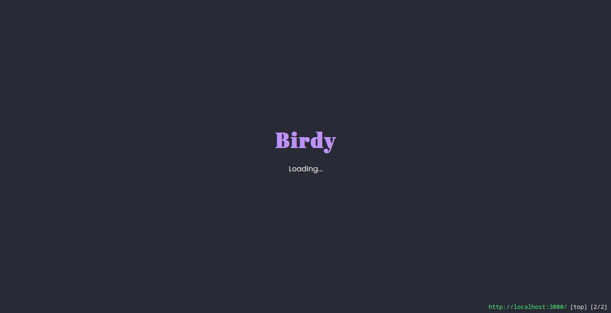
<br>
<hr />

## BirdyLogo
<br>

### Rôle

> <ul><li>Le logo du site</li></ul>

### Props

> <ul><li>Aucun</li></ul>

### States

> <ul><li>Aucun</li></ul>

### Avancement

> <ul><li>Terminé</li></ul>

### Preview

> Le composant BirdyLogo:
> <br><br>
> 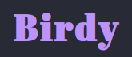
<br>
<hr />

## NotFound
<br>

### Rôle

> <ul><li>La page s'affichant en cas d'erreur de routage</li></ul>

### Props

> <ul><li>Aucun</li></ul>

### States

> <ul><li>Aucun</li></ul>

### Avancement

> <ul><li>Terminé</li></ul>

### Preview

> Le composant NotFound:
> <br><br>
> 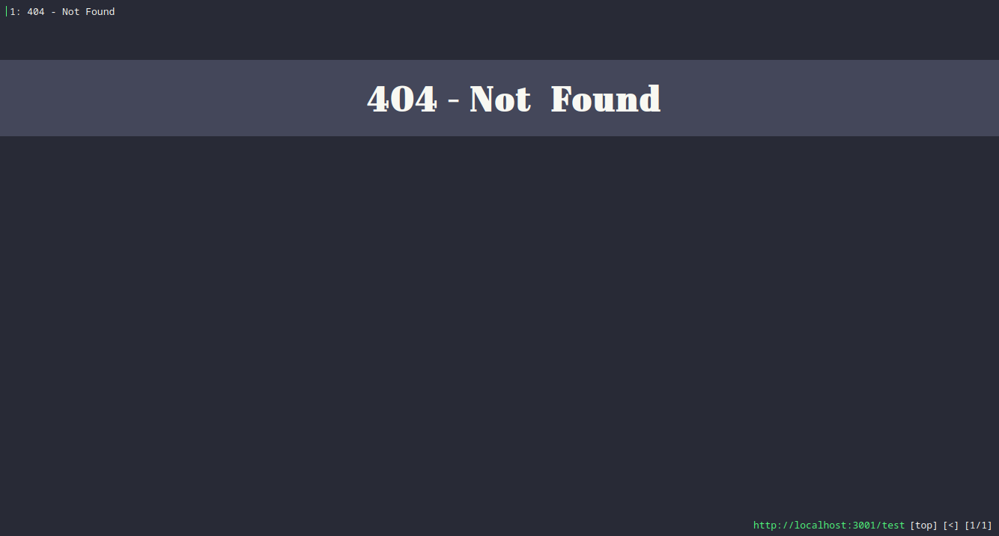
<br>
<hr />

## Login
<br>

### Rôle

> <ul>
>   <li>Gère la connexion d'un utilisateur</li>
>   <li>
>       Redirige vers le composant <strong>Profile</strong> 
>       de l'utilisateur en cas d'authentification réussie
>   </li>
>   <li>
>       Change d'état en cas de mauvais mot de passe ou d'email invalid<br>
>       <em>En cas de mauvais mot de passe on vide aussi le champ <strong>Password</strong> du formulaire</em>
>   </li>
> </ul>

### Props

> <ul><li>Aucun</li></ul>

### States

> <ul><li>Le formulaire contenant l'adresse email et le mot de passe</li></ul>

### Avancement

> <ul><li>Terminé</li></ul>

### Preview

> Le composant Login :
> <br><br>
> 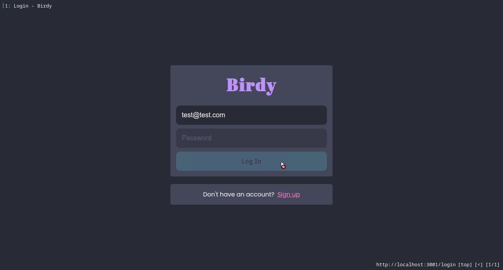
> <br><br><br>
> En cas d'adresse email invalide :
> <br><br>
> 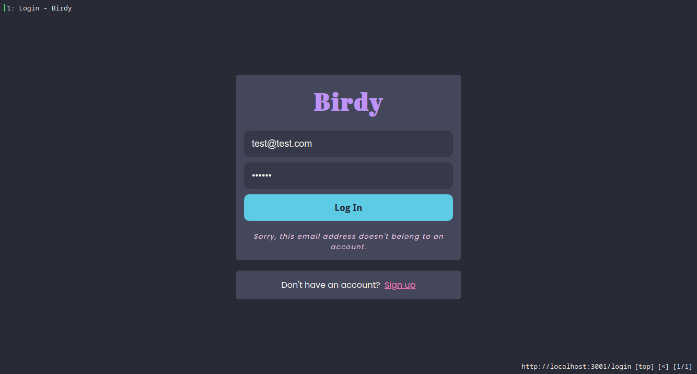
> <br><br><br>
> En cas de mot de passe invalide :
> <br><br>
> 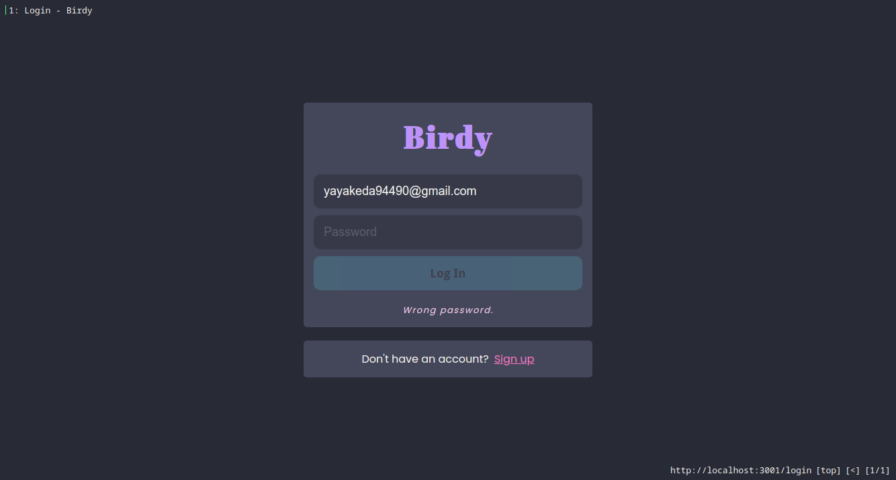
<br>
<hr />

## Signup
<br>

### Rôle

> <ul>
>   <li>Gère l'inscription d'un utilisateur</li>
>   <li>
>       Redirige vers le composant <strong>Profile</strong> 
>       de l'utilisateur en cas d'inscription réussie
>   </li>
>   <li>
>       Change d'état si un utilisateur avec cette adresse email ou ce pseudo existe déjà
>   </li>
> </ul>

### Props

> <ul><li>Aucun</li></ul>

### States

> <ul>
>   <li>
>       Le formulaire contenant le pseudo, la date de naissance, le nom complet,
>    l'adresse email et le mot de passe
>   </li>
>   <li>
>      Le message d'erreur à afficher 
>   </li>
> </ul>

### Avancement

> <ul><li>Terminé</li></ul>

### Preview

> Le composant Signup :
> <br><br>
> 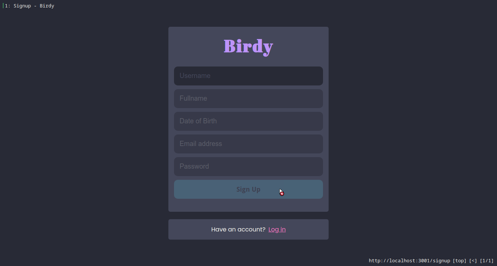
> <br><br><br>
> En cas d'adresse email déjà utilisée par un autre utilisateur :
> <br><br>
> 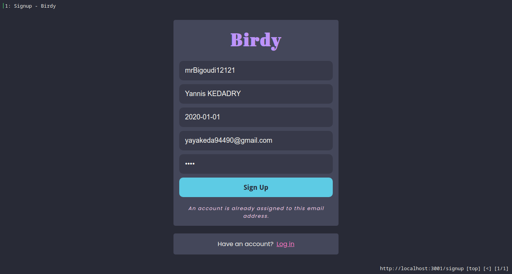
> <br><br><br>
> En cas de pseudo déjà utilisé par un autre utilisateur :
> <br><br>
> 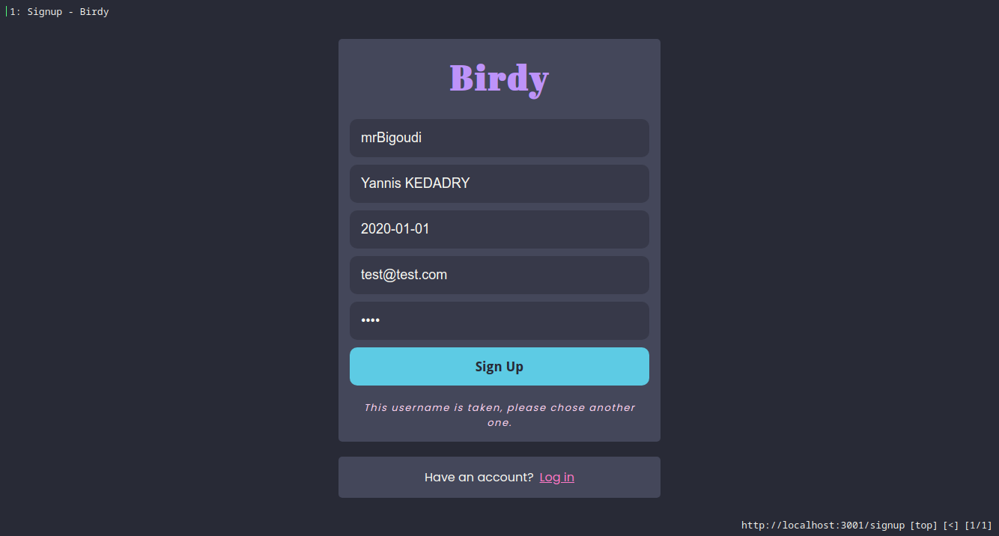
<br>
<hr />

## Dashboard
<br>

### Rôle

> <ul>
>   <li>La page d'acceuil du site</li>
>   <li>Affiche les tweets les plus récents</li>
>   <li>Permet de voir les réponses à ces tweets</li>
>   <li>Redirige vers les pages d'inscription et de connections</li>
>   <li>Permet de gérer quelques options basiques</li>
>   <li>Permet de faire quelques recherches globales dans le site</li>
> </ul>

### Props

> <ul><li>Aucun</li></ul>

### States

> <ul><li>Aucun</li></ul>

### Avancement

> <ul><li>En cours</li></ul>

### Preview

> Le composant Dashboard:
> <br><br>
> 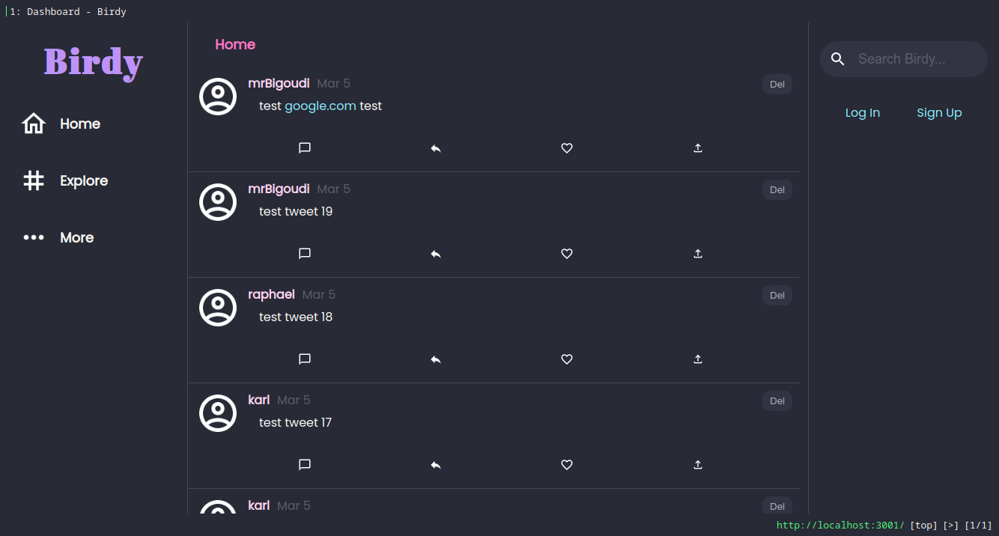
<br>
<hr />

## Profile
<br>

### Rôle

> <ul>
>   <li>La page d'un utilisateur connecté</li>
>   <li>Affiche les tweets les plus récents</li>
>   <li>Permet de gérer les options de l'utilisateur</li>
>   <li>
>         Donne accès à la liste des personnes suivis, des personnes 
>         qui nous suivent, des messages privés, des messages aimés, des messages retweetés
>         et des tweets envoyés par l'utilisateur
>   </li>
>   <li>Permet de faire des recherches globales dans le site et locales à l'utilisateur</li>
>   <li>Permet d'aimer un tweet, d'y répondre, de le retweeter et de le partager</li>
> </ul>

### Props

> <ul><li>Aucun</li></ul>

### States

> <ul><li>Aucun (ce sont les composants enfants qui vont chager)</li></ul>

### Avancement

> <ul>
>    <li>
>         En cours <em>(il s'agit du composant pouvant encore évoluer le plus, car il y a toujours plein d'améliorations et de nouvelles fonctionnalités possibles)</em>
>    </li>
> </ul>

### Preview

> Le composant Profile (<em>dans l'état actuel, mais des changements sont à prévoir</em>):
> <br><br>
> 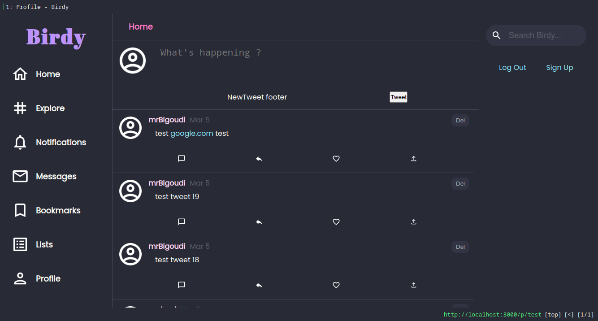
<br>
<hr />

## NavBar
<br>

### Rôle

> <ul>
>   <li>Permet de naviguer au sein du Dashboard ou d'un Profile</li>
> </ul>

### Props

> <ul><li>Une liste des icones à afficher dans le menu et le handler de leur actions</li></ul>

### States

> <ul><li>Aucun</li></ul>

### Avancement

> <ul><li>Terminé</li></ul>

### Preview

> Le composant NavBar (<em>red border</em>):
> <br><br>
> 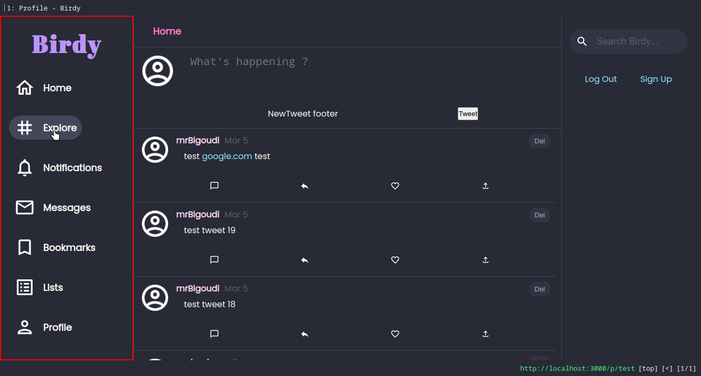
> Le composant NavBar lorsqu'un utilisateur est connecté:
> <br><br>
> 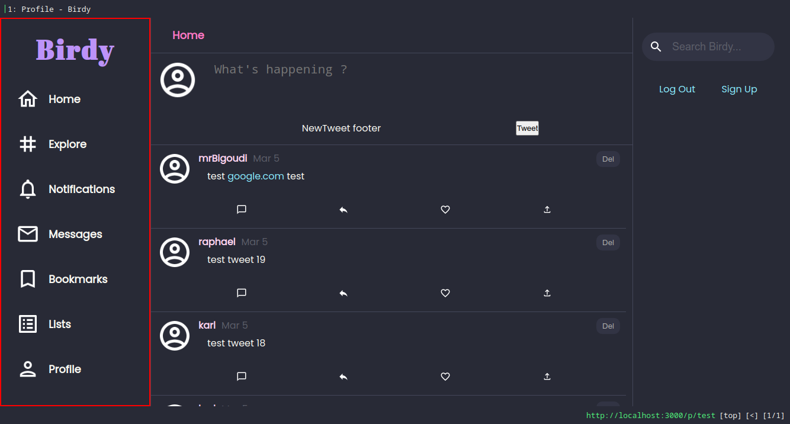
<br>
<hr />

## MenuIcon
<br>

### Rôle

> <ul>
>   <li>Gère un des menus de la bar de navigation</li>
> </ul>

### Props

> <ul>
>    <li>src: la source de l'icone à afficher</li>
>    <li>alt: le texte alternatif à afficher en cas de mauvais chargement</li>
>    <li>msg: le nom du menu (s'affiche à côté de l'icone)</li>
>    <li>onClick: le handler à effectuer quand on clique sur le MenuIcon</li>
> </ul>

### States

> <ul><li>Aucun</li></ul>

### Avancement

> <ul><li>Terminé</li></ul>

### Preview

> Le composant MenuIcon:
> <br><br>
> 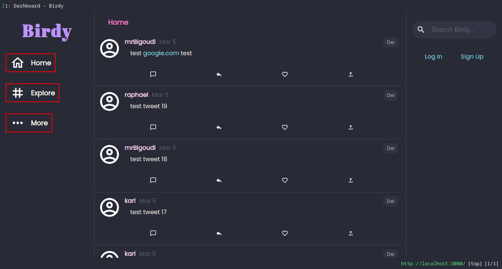
<br>
<hr />

## SideBar
<br>

### Rôle

> <ul>
>   <li>
>         Gère la recherche sur le site et les redirections vers les formulaires de connexions
>   </li>
> </ul>

### Props

> <ul>
>    <li>logged: permet de savoir si on est sur une page de profile ou sur le dashboard</li>
> </ul>

### States

> <ul><li>Aucun</li></ul>

### Avancement

> <ul><li>Terminé</li></ul>

### Preview

> Le composant SideBar:
> <br><br>
> 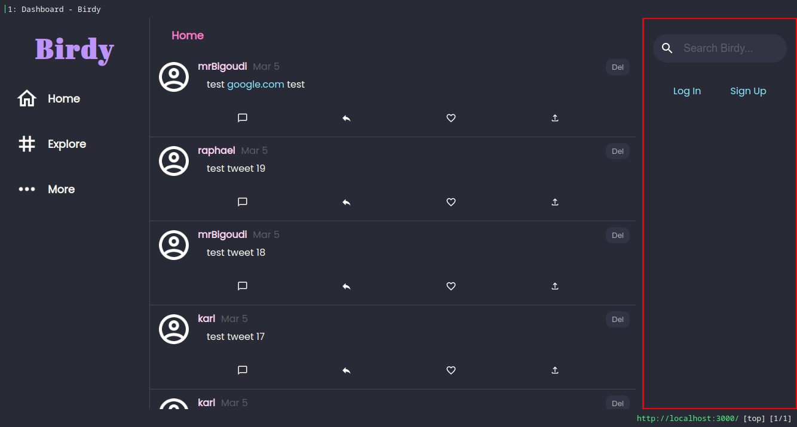
> <br><br><br>
> Le composant SideBar lorsqu'un utilisateur est connecté:
> <br><br>
> 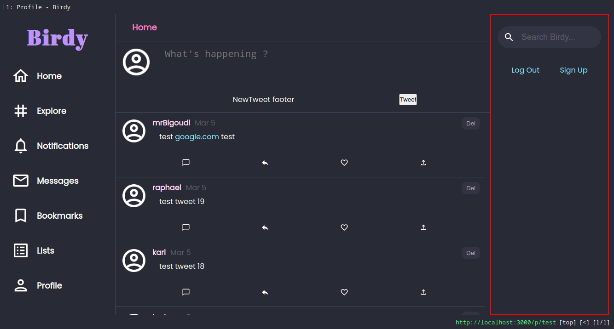
<br>
<hr />

## SearchBar
<br>

### Rôle

> <ul><li>Gère les recherches sur le site</li></ul>

### Props

> <ul><li>Aucun</li></ul>

### States

> <ul><li>Aucun</li></ul>

### Avancement

> <ul><li>En cours (il manque les résultats des recherches)</li></ul>

### Preview

> Le composant SearchBar:
> <br><br>
> 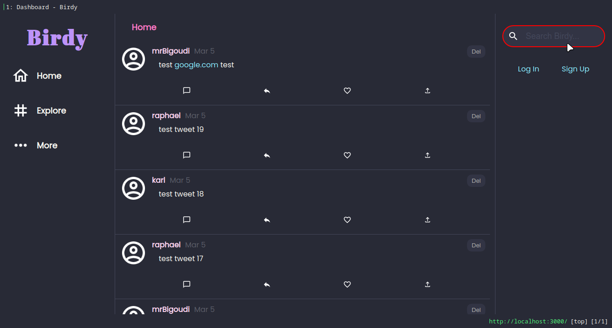
<br>
<hr />

## Timeline
<br>

### Rôle

> <ul>
>   <li>Affiche les tweets</li>
>   <li>Affiche les commentaires</li>
>   <li>
>       Permet d'écrire un tweet ou un commentaire <em>(si l'utilisateur est connecté)</em>
>   </li>
> </ul>

### Props

> <ul>
>    <li>tweets: la liste des tweets à afficher</li>
>    <li>default: permet de savoir si un utilisateur est connecté ou non</li>
>    <li>user: l'utilisateur connecté</li>
> </ul>

### States

> <ul>
>    <li>tweetList: la liste des tweets à afficher</li>
> </ul>

### Avancement

> <ul><li>En cours</li></ul>

### Preview

> Le composant Timeline:
> <br><br>
> 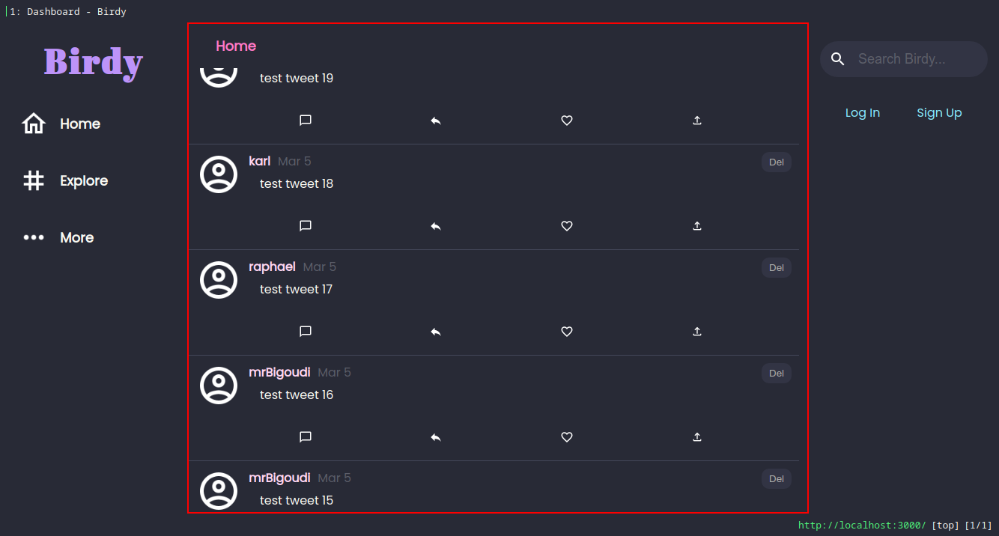
<br>
<hr />

## Tweet
<br>

### Rôle

> <ul>
>   <li>Affiche un tweet</li>
>   <li>
>       Permet d'interagir avec un tweet <em>(si l'utilisateur est connecté)</em>
>   </li>
> </ul>

### Props

> <ul>
>    <li>tweet: le tweet à afficher</li>
>    <li>deleted: permet de savoir si le tweet a été masqué par un utilisateur</li>
>    <li>user: l'utilisateur connecté</li>
>    <li>default: permet de savoir si un utilisateur est connecté ou s'il s'agit du dashboard</li>
>    <li>onDelete: action à réaliser quand on masque le tweet</li>
> </ul>

### States

> <ul>
>    <li>nbReplies: le nombre de commentaires</li>
>    <li>nbRetweets: le nombre de retweet</li>
>    <li>nbLikes: le nombre d'utilisateurs ayant aimé le tweet</li>
>    <li>deleted: tweet effacé ou non</li>
> </ul>

### Avancement

> <ul><li>En cours</li></ul>

### Preview

> Le composant Tweet:
> <br><br>
> 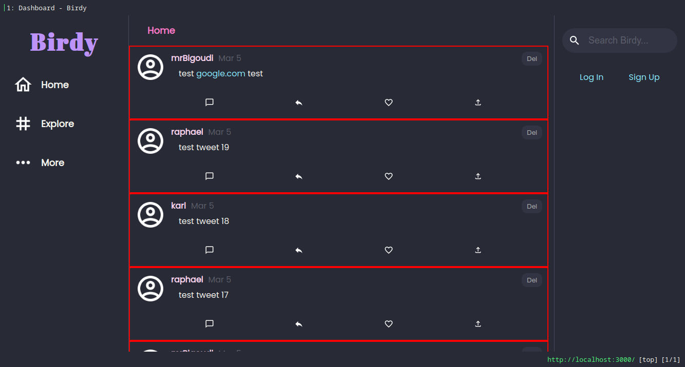
> <br><br><br>
> Le composant Tweet lorsqu'un utilisateur est connecté:
> <br><br>
> 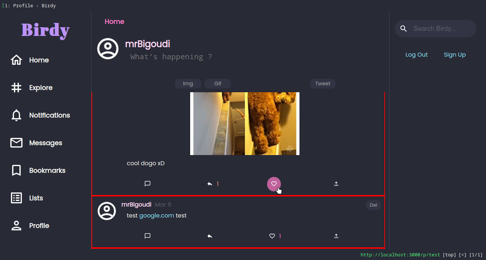
<br>
<hr />

## TweetDeleted
<br>

### Rôle

> <ul>
>   <li>
>         Affiche un tweet masqué par l'utilisateur<em>
>         (Le tweet peut être restoré en rappuyant sur un button)</em>
>   </li>
> </ul>

### Props

> <ul>
>    <li>id: l'identifiant du tweet à masquer</li>
>    <li>deleted: permet de savoir si le tweet a été masqué par un utilisateur</li>
>    <li>onDelete: action à réaliser quand on masque le tweet</li>
> </ul>

### States

> <ul>
>    <li>deleted: tweet effacé ou non</li>
> </ul>

### Avancement

> <ul><li>Terminé</li></ul>

### Preview

> Le composant TweetDeleted:
> <br><br>
> 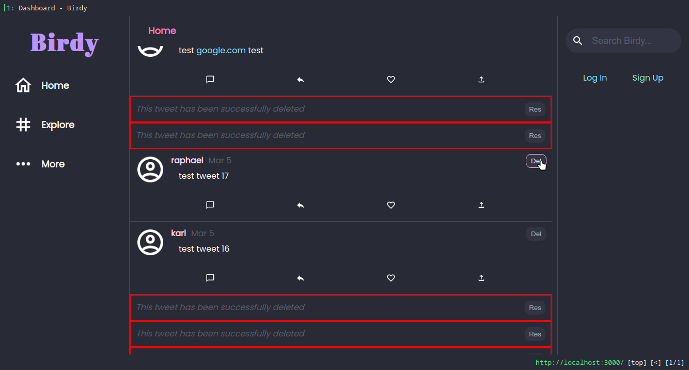
<br>
<hr />

## TweetIcon
<br>

### Rôle

> <ul><li>Gère l'affichage des icones dans le footer des tweets</li></ul>

### Props

> <ul>
>    <li>name: le nom de l'icone</li>
>    <li>imageSrc: le chemin vers l'image</li>
>    <li>cpt: le compteur à afficher <em>(uniquement si cpt>0)</em></li>
>    <li>onClick: action à réaliser quand on clique sur l'icone</li>
> </ul>

### States

> <ul><li>Aucun</li></ul>

### Avancement

> <ul><li>Terminé</li></ul>

### Preview

> Le composant TweetIcon:
> <br><br>
> 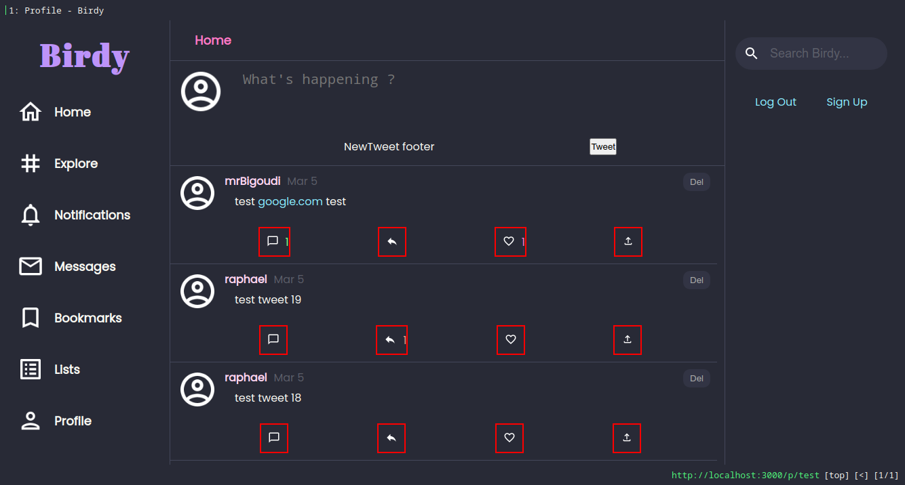
<br>
<hr />

## NewTweet
<br>

### Rôle

> <ul><li>Permet à l'utilisateur de poster un nouveau tweet</li></ul>

### Props

> <ul>
>    <li>user: l'utilisateur connecté'</li>
>    <li>onPost: l'action à réaliser lorsque l'on veut poster le tweet</li>
> </ul>

### States

> <ul>
>    <li>
>         tweetContent: le contenu du formulaire caché derrière la création du nouveau tweet
>    </li>
>    <li>
>         error: indique s'il y a une erreur dans le tweet
>    </li>
> </ul>

### Avancement

> <ul><li>En cours (il manque notemment l'intégratioon d'images et de gif animés</li></ul>

### Preview

> Le composant NewTweet:
> <br><br>
> 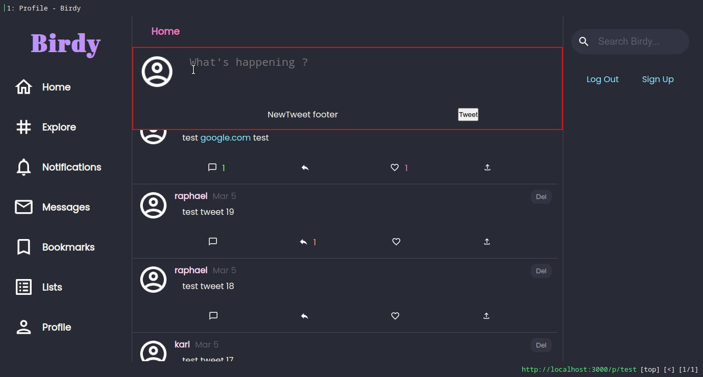
<br>
<hr />